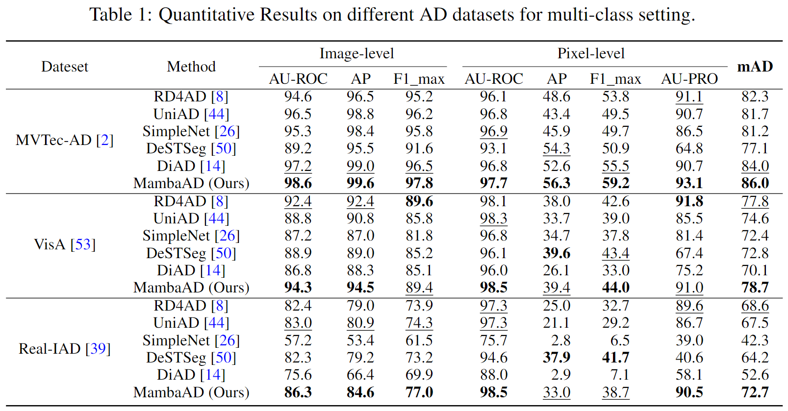

<div align="center">

<h3>MambaAD: Exploring State Space Models for Multi-class Unsupervised Anomaly Detection</h3>

[Haoyang He<sup>1*</sup>](https://scholar.google.com/citations?hl=zh-CN&user=8NfQv1sAAAAJ),
[Yuhu Bai<sup>1*</sup>](https://scholar.google.com/citations?hl=zh-CN&user=ucCvgooAAAAJ),
[Jiangning Zhang<sup>2</sup>](https://zhangzjn.github.io),
[Qingdong He<sup>2</sup>](https://scholar.google.com/citations?hl=zh-CN&user=gUJWww0AAAAJ),
[Hongxu Chen<sup>1</sup>](https://scholar.google.com/citations?hl=zh-CN&user=uFT3YfMAAAAJ)

[Zhenye Gan<sup>2</sup>](https://scholar.google.com/citations?user=fa4NkScAAAAJ&hl=zh-CN),
[Chengjie Wang<sup>2</sup>](https://scholar.google.com/citations?hl=zh-CN&user=fqte5H4AAAAJ),
[Xiangtai Li<sup>3</sup>](https://lxtgh.github.io/),
[Guanzhong Tian<sup>1</sup>](https://scholar.google.com/citations?hl=zh-CN&user=0q-7PI4AAAAJ),
[Lei Xie<sup>1</sup>](https://scholar.google.com/citations?hl=zh-CN&user=7ZZ_-m0AAAAJ)

<sup>1</sup>College of Control Science and Engineering, Zhejiang University, 
<sup>2</sup>Youtu Lab, Tencent,
<sup>3</sup>Nanyang Technological University, Singapore

[[`Paper`](https://arxiv.org/pdf/2404.06564.pdf)] 
[[`Project Page`](https://lewandofskee.github.io/projects/MambaAD/)]

Our MambaAD is based on [ADer](https://github.com/zhangzjn/ADer).

##Congratulations! Our MambaAD has been accepted at the NeurIPS 2024 conference!##

</div>

## Abstract
Recent advancements in anomaly detection have seen the efficacy of CNN- and transformer-based approaches. However, CNNs struggle with long-range dependencies, while transformers are burdened by quadratic computational complexity. Mamba-based models, with their superior long-range modeling and linear efficiency, have garnered substantial attention. This study pioneers the application of Mamba to multi-class unsupervised anomaly detection, presenting MambaAD, which consists of a pre-trained encoder and a Mamba decoder featuring Locality-Enhanced State Space (LSS) modules at multi-scales. The proposed LSS module, integrating parallel cascaded (Hybrid State Space) HSS blocks and multi-kernel convolutions operations, effectively captures both long-range and local information. The HSS block, utilizing (Hybrid Scanning) HS encoders, encodes feature maps into five scanning methods and eight directions, thereby strengthening global connections through the (State Space Model) SSM. The use of Hilbert scanning and eight directions significantly improves feature sequence modeling. Comprehensive experiments on six diverse anomaly detection datasets and seven metrics demonstrate SoTA performance, substantiating the method's effectiveness.

## Overview
<p align="center">
  
</p>

---
## 🛠️ Getting Started

### Installation
- Clone this repo to [ADer](https://github.com/zhangzjn/ADer).
- Prepare the MambaAD extra environment
  ```shell
  pip3 install triton causal_conv1d mamba_ssm numpy-hilbert-curve pyzorder
  ```

## 📜 Multi-class Results on Popular AD Datasets

Subscripts `I`, `R`, and `P` represent `image-level`, `region-level`, and `pixel-level`, respectively.

### MambaAD Results
|   Method    | mAU-ROC<sub>I</sub> | mAP<sub>I</sub> | m*F*1-max<sub>I</sub> | mAU-ROC<sub>P</sub> | mAP<sub>P</sub> | m*F*1-max<sub>P</sub> | mAU-PRO<sub>R</sub> |                                                                            <span style="color:blue">Download</span>                                                                            |
|:-----------:|:-------------------:|:---------------:|:---------------------:|:-------------------:|:---------------:|:---------------------:|:-------------------:|:----------------------------------------------------------------------------------------------------------------------------------------------------------------------------------------------:|
|  MVTec-AD   |        98.6         |      99.6       |         97.8          |        97.7         |      56.3       |         59.2          |        93.1         | [log](https://drive.google.com/file/d/1L4DPuG_CnIVTFJAr4CYbtQnWf_M8tyeS/view?usp=sharing) & [weight](https://drive.google.com/file/d/106yCTXItiQ70BUujpK9TbdHaWgyzdSdS/view?usp=sharing) |
|    VisA     |        94.3         |      94.5       |         89.4          |        98.5         |      39.4       |         44.0          |        91.0         | [log](https://drive.google.com/file/d/1Ys8IePvEOiSscIloMqsIGJqat7SqRBMN/view?usp=sharing) & [weight](https://drive.google.com/file/d/1mDK9vZHZ9qwlEI0GbfScUcXxmFesnU4q/view?usp=sharing)                                                  |
|  Real-IAD   |        86.3         |      84.6       |         77.0          |        98.5         |      33.0       |         38.7          |        90.5         | [log](https://drive.google.com/file/d/1DFIlVndppheOD6S41U1ltMi3dNMA9v8B/view?usp=sharing) & [weight](https://drive.google.com/file/d/1h5dBFrkHL4xvulUQTukNqT-KNYcnNJ5W/view?usp=sharing) |
| Uni-Medical |        83.7         |      80.1       |         82.0          |        96.9         |      45.4       |         47.3          |        87.5         | [log](https://drive.google.com/file/d/14bjLHAoy0U4mcoZcY6iyVB303FwYGi4v/view?usp=sharing) & [weight](https://drive.google.com/file/d/1ypRvGBj05KD4BbixkbBMMVVHsN_S_ihU/view?usp=sharing)        |
|   COCO-AD   |        63.9         |      56.2       |         63.2          |        69.3         |      16.9       |         22.2          |        40.5         | [log](https://drive.google.com/file/d/1QMOt6S3f1ttMAgdDTqOLLIdYfS0abqJt/view?usp=sharing) & [weight](https://drive.google.com/file/d/1PyUGScDY2xZvYT9yCkIVqg43LRRehkSu/view?usp=sharing)                                                                                                                                                                         |
|  MVTec-3D   |        86.2         |      95.8       |         92.8          |        98.6         |      37.5       |         41.1          |        93.6         | [log](https://drive.google.com/file/d/1I-LUg44O2KLhBvphaTDaJbcIV-K6UTHG/view?usp=sharing) & [weight](https://drive.google.com/file/d/10A6Eh5X4IEbk254ePqeTaLItFkyxan7C/view?usp=sharing)                                                                                          |


[//]: # (## Main results)

[//]: # (<p align="center">)

[//]: # (  )

[//]: # (</p>)

## Citation
If you find this code useful, don't forget to star the repo and cite the paper:
```
@article{he2024mambaad,
      title={MambaAD: Exploring State Space Models for Multi-class Unsupervised Anomaly Detection}, 
      author={Haoyang He and Yuhu Bai and Jiangning Zhang and Qingdong He and Hongxu Chen and Zhenye Gan and Chengjie Wang and Xiangtai Li and Guanzhong Tian and Lei Xie},
      journal={arXiv preprint arXiv:2404.06564},
      year={2024},
}
```
## Acknowledgements
We thank the great works [ADer](https://github.com/zhangzjn/ADer), [VMamba](https://github.com/MzeroMiko/VMamba) for providing assistance for our research.

